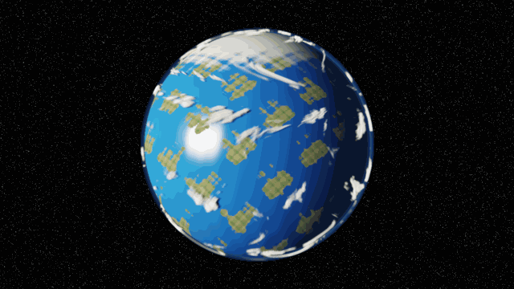

<div align="center">
  

  # 🌍 UniversCraft HoloEngine

  **Next-Generation Procedural Engine in Rust • Zero-Copy GPU Rendering • Built on Real Topology**

  [](https://rust-lang.org)
  [](https://wgpu.rs)
  [](LICENSE)
</div>

<br/>

**HoloEngine** is the technological core of the UniversCraft project. It replaces classical floating-point workarounds with rigorous mathematical structures—delivering flawless transitions from molecular physics to galactic clusters without tearing, aliasing, or finite-time blow-ups.

## 🚀 The 4 Pillars of HoloEngine

Our architecture is strictly enforced by real mathematical topologies and invariants:

1. **Dual-Scale Topological Geometry (T-Duality)**
   Standard rendering engines suffer from precision loss when zooming from galaxies to grains of sand. HoloEngine utilizes a T-Dual Effective Metric: $R_{eff} = \max(R, \alpha'/R)$. Instead of precision breakdown, geometry smoothly inverts and projects onto discrete K3 fibers when crossing the string-scale boundary $\sqrt{\alpha'}$.
2. **Vietoris-Rips Persistent Homology (TDA)**
   Pathfinding and connectivity aren't based on classical NavMeshes. The engine continuously computes Betti numbers ($B_0$: components, $B_1$: loops, $B_2$: voids) on dynamic particle clouds, allowing AI agents to navigate through collapsing caves or fluid structures via topological gradients.
3. **Leray-Hopf Incompressible Fluid Dynamics**
   We enforce a true solenoidal projection $\nabla \cdot \vec{v} = 0$ on our Symplectic SPH (Smoothed Particle Hydrodynamics) solvers. Combined with a strict Kinetic Energy bound (preventing enstrophy spikes), our fluids never explode, maintaining absolute numerical stability even in violent weather or massive waterfalls.
4. **Deep Oscillatory Neural Networks (DONN)**
   Procedural generation uses native 1-Lipschitz bounded neural fields rather than Perlin noise. This guarantees exact topological intersections (CSG operations without tearing) using continuous trigonometric harmonics.

---

## 📸 Real-Time Capabilities

The engine features a **Zero-Copy GPU Compute Pipeline** written in WGSL, delegating all heavy mathematical evaluations (SDFs, Raymarching, Oceanic Solenoidal waves, and Boussinesq Volumetric Clouds) directly to the VRAM.

### The Earth Orbit Manifold

We've recently upgraded the Earth Shader with **intricate continental procedural generation** and **massive topological atmospheric vortices**:

*   **S² Topological Projection:** Direct spherical mapping, eliminating all polar singularities.
*   **Volumetric Boussinesq Clouds:** A dense, volumetric shell featuring hurricane-scale chaotic swirl mathematics.
*   **Multi-layer Raymarching:** Rayleigh (Blue Gas) + Mie (White Aerosols) + Optical Vacuum constraints.

---

## 🛠️ Roadmap & Development

A comprehensive technical audit has just been completed, resulting in a strict 6-phase improvement plan:

*   [x] **Phase A:** Build Environment Optimization
*   [x] **Phase B:** Mathematical Formalism Corrections (Enstrophy & Lipschitz bias fixes)
*   [x] **Phase C:** Architecture (GPU Context persistence & modular shaders)
*   [ ] **Phase D:** Dependency Honesty & Integration
*   [ ] **Phase E:** Formal Verification (Lean 4 & Verus integration)
*   [ ] **Phase F:** Full Bevy WGSL Pipeline Wiring

For detailed technical analysis, please see our [Improvement Plan](specs/HoloEngine_Improvement_Plan.md).

## 🎮 Local Live Demo

You can view the real-time WebGPU demonstration directly in your browser without compiling the Rust backend!

```bash
cd holo_engine
python serve_demo.py
```
Then open `http://localhost:8080` in Chrome 113+ or Edge 113+.

---

<div align="center">
  <i>Developed with ❤️ for the next generation of procedural simulations.</i>
</div>
